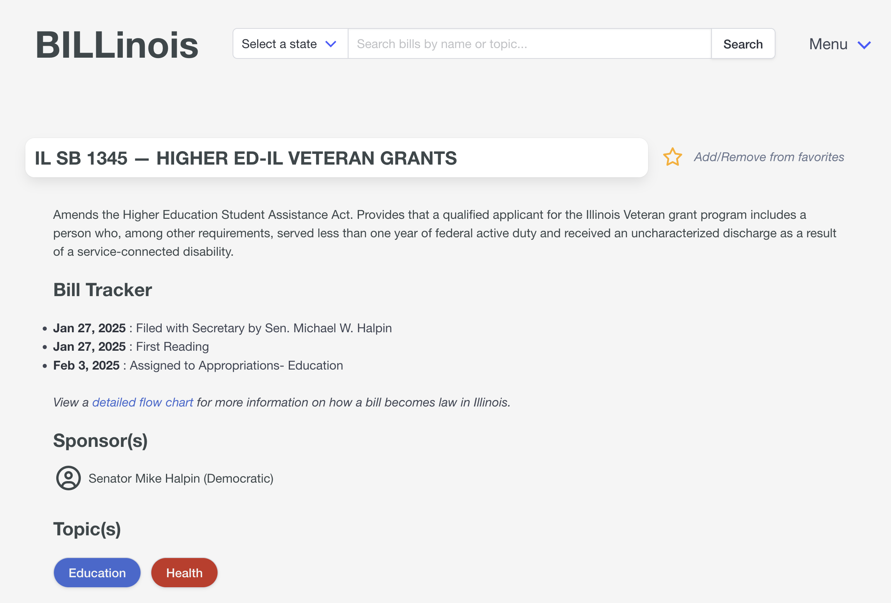

# BILLinois

A friendly civic engagement tool that notifies users about their favorite bills. BILLinois allows users to search bills by name or by topic, view additional information about each bill including a summary of the bill, a tracker of its status, and its sponsors, and login to add bills of interest and sign up for notifications about those bills of interest. The live site is now available at [billinois.unnamed.computer](https://billinois.unnamed.computer/) or [billinoisapp.com](https://billinoisapp.com).

BILLinois's initial focus is on the Illinois General Assembly, but a long-term goal of the project is to expand either to additional states or to additional levels of government. The website is also set up to include legislation from the Indiana General Assembly, and bills for either state can be searched for using the "Select a state" dropdown. However, the primary focus of the tool at this point remains on the Illinois General Assembly.

## Using BILLinois

On the initial landing page, users can either search for a bill by name or topic, or select the "Menu" dropdown to log in to their account or create an account. For further personalization of the search process, users can also select a state to filter results to (currently Illinois or Indiana), or can select one of a pre-defined list of topics included as buttons below the search bar, which will conduct a search for bills relevant to that topic.

On the search results page, all bills meeting the search criteria are displayed with information including their bill number, bill title, latest status, and relevant topics. Users can also add a bill to their favorites from this page if they are logged in. The same search bar as on the landing page is available at the top of this page and of all pages in the tool.

On the page for each bill, more detailed information is displayed including a summary of the bill's contents, a tracker of each major action that has occurred for the bill, and a list of the bill's sponsors. Users can also add a bill to their favorites from this page if they are logged in.

Once logged in, users can also access a profile page where they will see their profile information and a list of their favorited bills. On this page, users can also edit their personal information, change whether they are receiving notifications about their favorited bills, and access the pages for any of their favorited bills directly.

<!--  -->

## Contributing to BILLinois

This project uses uv to manage dependencies. 

View [documentation](https://uchicago-capp-30320.github.io/BILLinois/) for this repository.

### Setup

1. Install [uv](https://docs.astral.sh/uv/getting-started/installation/)
2. Run `uv sync` to sync your local `.venv` with the requirements in `pyprojects.toml`
3. Run `uv tool install ruff` to install the [Ruff](https://github.com/astral-sh/ruff) linter
4. Run `uv add --dev pytest` to get setup with testing (this is a development package not included in the requirements)
5. Before pushing commits, run `ruff format` and `ruff check` to ensure you don't get shamed by Ruff 6. Currently GitHub Actions will automatically run this step for you, pending advice from James

### Creating your own branch

After cloning the repository:

1. `git switch frontend` or `git switch backend` to make a feature branch from one of these branches
2. `git switch` to your feature branch

### Before each work session

1. If using command line, run `git pull` and `git merge PARENT_BRANCH`. For example, if your feature branch is branched from `frontend`, run `git merge frontend`. This will pull all the most recent changes from `frontend` to your sub-branch.

## Repository Layout

- `project`: includes main app script (frontend and backend)
- `data`: contains data files used in project
- `tests`: contains all tests related to the project

## Development of BILLinois

This project was created by University of Chicago MSCAPP students as a class project for [Software Engineering for Civic Tech](https://capp30320.jpt.sh/), taught by Professor [James Turk](https://www.jpt.sh/).

Development Team

- Livia Mucciolo

- Echo Nattinger

- Joaquin Pinto

- Caitlin Pratt

- David Steffen

- Suchi Tailor

- Karen Yi
