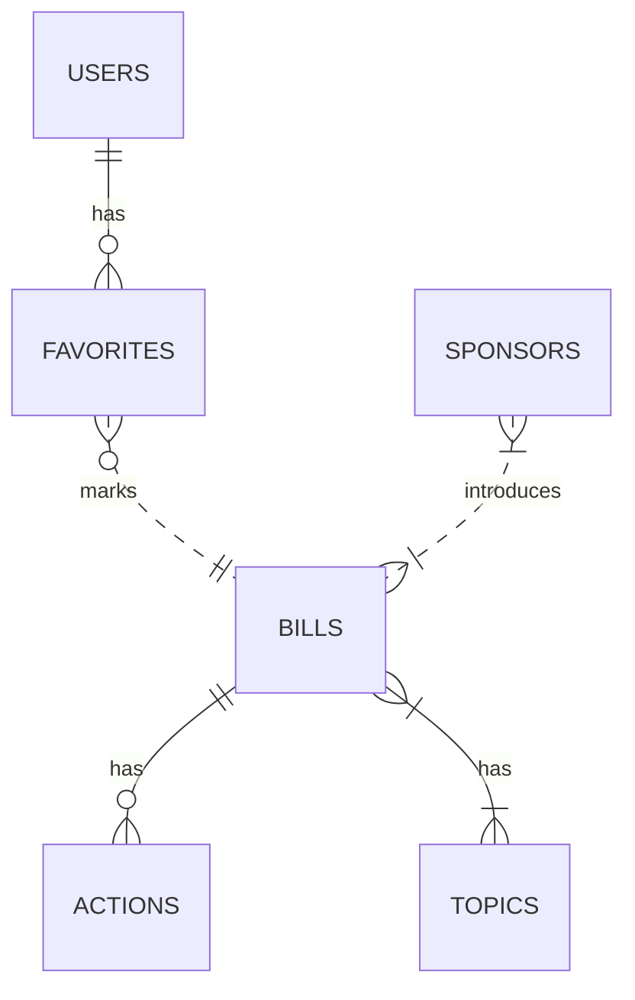

# Postgres Tables

## Users

::: apps.accounts.models.User

### Has Connections From:

* Favorites

| Name     | Type                       | Description          |
| -------- | -------------------------- | -------------------- |
| id       | PrimaryKey, bigint, unique | Internal user id     |
| password | Varchar                    | Hashed user password |
| email    | Varchar                    | User email address   |
| username | Varchar                    | User's username      |
| phone    | Varchar                    | User's phone number  |

## Actions

::: apps.core.models.ActionsTable

### Connects to:

* Bills (on bill_id ForeignKey)

| Name        | Type                        | Description                                                  |
| ----------- | --------------------------- | ------------------------------------------------------------ |
| action_id   | Varchar, PrimaryKey, unique | Id of the action                                             |
| description | Varchar                     | Description of action, e.g. (“First Reading”)                |
| date        | Timestamp  with time zone   | Date of action                                               |
| category    | varchar, nullable           | Category of action. Used to group actions into broader types for tracking bill status |
| bill_id     | ForeignKey                  | `bill_id` from the bills_table for the bill associated with this action |

## Bills

::: apps.core.models.BillsTable

### Has Connections From:

* Actions
* Favorites
* Sponsors
* Topics

| Name    | Type                        | Description                                 |
| ------- | --------------------------- | ------------------------------------------- |
| bill_id | Varchar, PrimaryKey, unique | Id of the bill                              |
| number  | Varchar                     | Bill number used by legislature             |
| title   | Varchar                     | Official title of the bill                  |
| summary | Varchar                     | Bill summary as sourced from OpenStates API |
| status  | Varchar                     | The latest action taken on the bill         |

## Favorites

::: apps.core.models.FavoritesTable

### Connects to: 

* Bills (on bill_id ForeignKey)
* Users (on user_id ForeignKey)

| Name    | Type                | Description                                                  |
| ------- | ------------------- | ------------------------------------------------------------ |
| id      | Bigint, PrimaryKey  | Internal ID for a favorite                                   |
| bill_id | Varchar, ForeignKey | `bill_id` from the bills_table for the bill favorited        |
| user_id | Varchar, ForeignKey | `user_id` from the users table for the user favoriting the bill |

## Sponsors

::: apps.core.models.SponsorsTable

### Connects to:

* Bills (on bill_id ForeignKey)

| Name         | Type                        | Description                                                  |
| ------------ | --------------------------- | ------------------------------------------------------------ |
| id           | Varchar, PrimaryKey, unique | Internal id of the sponsor. Separate from sponsor_id as sponsor_id comes from OpenStates and may be null |
| sponsor_id   | Varchar                     | sponsor_id from OpenStates                                   |
| sponsor_name | Varchar                     | Name of the bill sponsor                                     |
| bill_id      | Varchar, ForeignKey         | `bill_id` from the bills table, the bill that the sponsor has sponsored |
| position     | Varchar, nullable           | The position: (e.g., Member of the State House, Member of the State Senate) that the sponsor occupies |
| party        | Varchar, nullable           | The political party of the sponsor                           |

## Topics

::: apps.core.models.TopicsTable

### Connects to:

* Bills (on bill_id ForeignKey)

| Name    | Type                | Description                                                  |
| ------- | ------------------- | ------------------------------------------------------------ |
| id      | Bigint, PrimaryKey  | ID of the topic                                              |
| topic   | Varchar             | Topic name                                                   |
| bill_id | Varchar, ForeignKey | `bill_id` from the bills table, the bill the topic is associated with |

