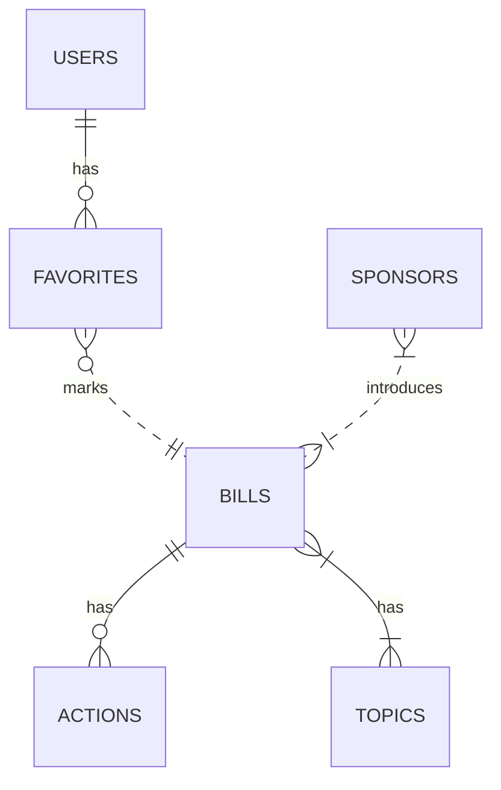

# Postgres Tables

## Users

::: apps.accounts.models.User

## Actions

::: apps.core.models.ActionsTable

## Bills

::: apps.core.models.BillsTable

## Favorites

::: apps.core.models.FavoritesTable

## Sponsors

::: apps.core.models.SponsorsTable

## Topics

::: apps.core.models.TopicsTable

## Updates

::: apps.core.models.UpdatesTable

## Most Recent Upload

::: apps.core.models.MostRecentUpload

## User Notification Queue
 
::: apps.core.models.UserNotificationQueue
