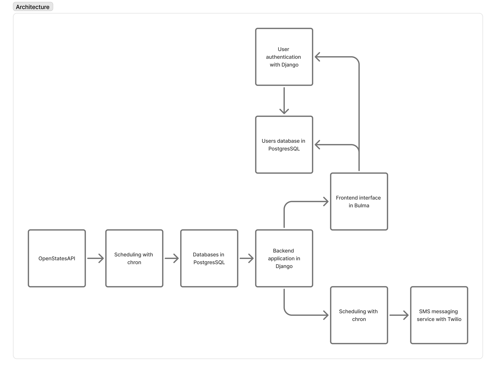
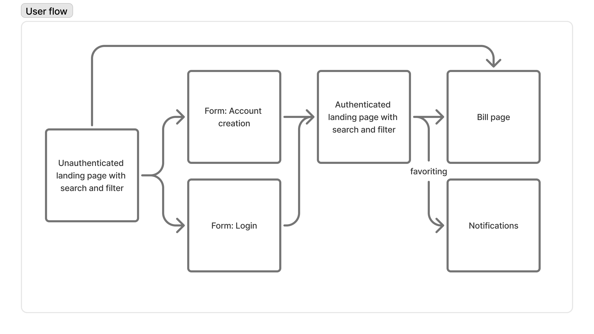

# Architecture

Start here for an overview of the applications we use to support BILLinois.

## Backend architecture

* **Data source**: [OpenStates API](https://docs.openstates.org/api-v3/)
  * OpenStates is a standardized data model for legislation from all 50 states.
* **Database**: [PostgreSQL](https://www.postgresql.org/)
  * Postgres can be less expensive than alternatives like AWS for our use case.
* **Backend**: [Django](https://docs.djangoproject.com/en/5.2/)
  * Django uses the model-view-controller paradigm, which helps for moderately complicated u
* **Authentication**: [Django](https://docs.djangoproject.com/en/5.2/topics/auth/default/)
  * Django has built-in flows for authentication, with the option to 
* **Frontend**: [Bulma](https://bulma.io/)
  * We use a CSS framework to simplify and standardize design.
* **Scheduling**: [cron](https://en.wikipedia.org/wiki/Cron) (a builtin Linux feature)
  * Runs scripts once a day to:
    * ingest updates to legislation from the API
    * notify users of any updates to their saved bills

## User flow

Overview of the user experience supported by the application architecture, for reference.

Users can search and filter bills as either an authenticated user or a guest, but users must be logged in to get notifications for bills. 

